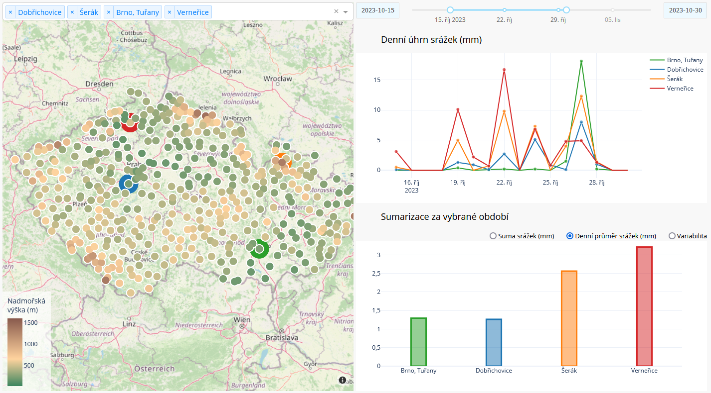

# Precipitation in the Czech Republic
A Plotly Dash Python web application for viewing recent precipitation data from Czech weather stations. 

The [**app**](http://danekpavel.eu.pythonanywhere.com/) is hosted on [PythonAnywhere](https://www.pythonanywhere.com/) and displays daily precipitation data (since 10 October 2023) from 424 weather stations across the Czech Republic. The user can select a time period and stations of interest for which daily and summary data by station are shown.

Data source: [Czech Hydrometeorological Institute](https://hydro.chmi.cz/hppsoldv/hpps_act_rain.php)
